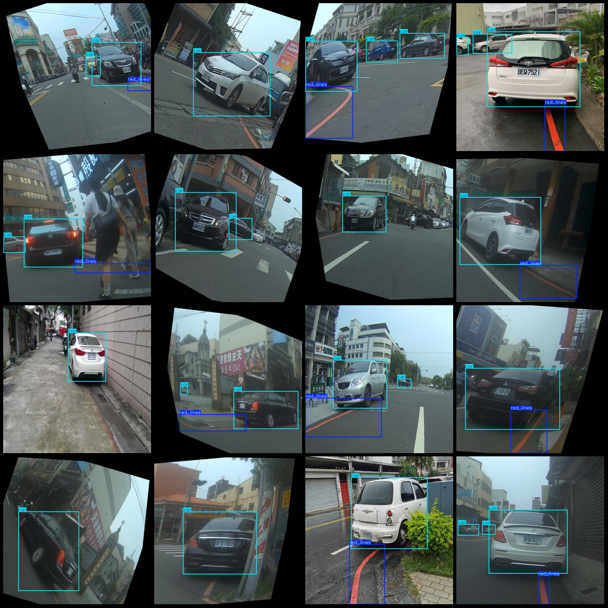

# Intelligent Transportation: Smart Traffic Vehicle Illegal Parking Dataset

**Dataset Overview:**
- **Format:** Pascal VOC + YOLO (excluding the segmentation path in txt files, only including jpg images and corresponding VOC XML files, as well as YOLO txt files)
- **Image Count (JPG Files):** 979
- **Annotation Count (XML Files):** 979
- **Annotation Count (Txt Files):** 979
- **Number of Annotation Categories:** 2
- **Label Names for Annotation Categories:** ["car", "red_lines"]
- **Box Counts per Category:**
  - Car (vehicle) boxes = 1474
  - Red lines (red lines) boxes = 667
- **Total Boxes:** 2141
- **Image Resolution:** 640x640
- **Annotation Tool:** labelImg
- **Annotation Rules:** Draw bounding boxes for each category
- **Important Notes:** None
- **Special Remarks:** This dataset does not guarantee the accuracy of any trained models or weight files.

**Image Preview:**

**Annotation Example:**

[Insert image with annotating example]

## Images

Here is a pay link on Stripe ( https://buy.stripe.com/3cs8yP7sY87d0vu9AB ). Please contact me lonlonago@foxmail.com after funding $89, and I will send you a complete data files , thank you!

